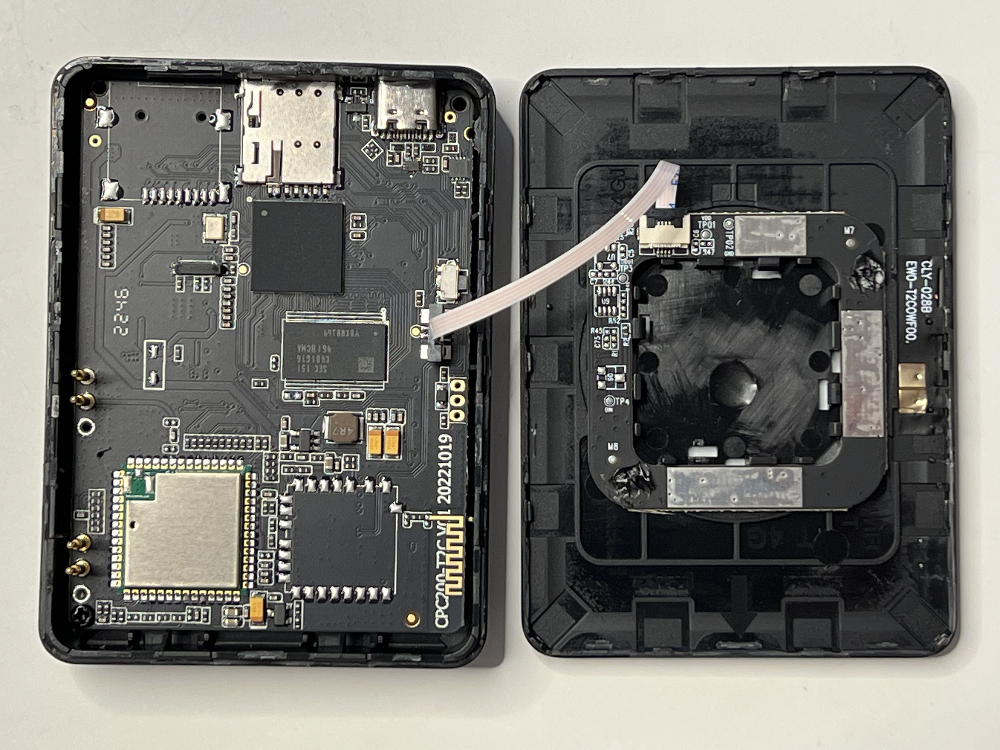

# Autokit CPC200 T2C research



## Notes

- WiFi only model
- PCB Rev: `20221019`
- Hardware version: `CA-BT-PanNet-A1`
- Initial firmware version: `23071316.4.9`

## Chips

- Main SoC: Allwinner [V833](https://linux-sunxi.org/images/2/25/V833_V831_Datasheet_V1.1%28For_SoChip%29.pdf) (sun8iw19, Cortex-A7)
- RAM: Samsung [K4B1G1646I-BCMA](https://semiconductor.samsung.com/dram/ddr/ddr3/k4b1g1646i-bcma/) (DDR3 1Gb)
- Flash: Winbond [W25Q128JV](https://www.mouser.com/datasheet/2/949/w25q128jv_revf_03272018_plus-1489608.pdf) (16 MB, 3.3v)
- WiFi/Bluetooth: Realtek RTL8821CS
- LTE-Modem: Neoway [N58-EA](http://www.wless.ru/files/GSM/Neoway/N58/Neoway_N58_Product_Specifications_V2_4.pdf)

## Flash Pinout

```
   -------------
1 -| ~CS   VCC |- 8
2 -|  DO  ~RST |- 7
3 -| ~WP   CLK |- 6
4 -| GND    DI |- 5
   -------------
```

## Flash Structure

The stage0 needs to be figured out.

| Start    | Size     | Partition   | Description             |
| -------- | -------- | ----------- | ----------------------- |
| 0x060000 | 0x040000 | env         | U-Boot env (reduntant)  |
| 0x0A0000 | 0x220000 | boot        | uImage                  |
| 0x2C0000 | 0x220000 | recovery    | uImage                  |
| 0x4E0000 | 0x300000 | rootfs      | Root SquashFS           |
| 0x7E0000 | 0x640000 | customer    | Customer SquashFS       |
| 0xe20000 | 0x010000 | private     |                         |
| 0xe30000 | 0x4a0000 | UDISK       | User Disk JFFS2         |

From DTS:

```
partitions {
    device_type = "partitions";

    env {
        device_type = "env";
        offset = <0x20>;
        size = <0x200>;
    };

    boot {
        device_type = "boot";
        offset = <0x220>;
        size = <0x1100>;
    };

    recovery {
        device_type = "recovery";
        offset = <0x1320>;
        size = <0x1100>;
    };

    rootfs {
        device_type = "rootfs";
        offset = <0x2420>;
        size = <0x1800>;
    };

    customer {
        device_type = "customer";
        offset = <0x3c20>;
        size = <0x3200>;
    };

    private {
        device_type = "private";
        offset = <0x6e20>;
        size = <0x80>;
    };

    UDISK {
        device_type = "UDISK";
        offset = <0x6ea0>;
        size = <0x00>;
    };
};
```

- Block size: 512
- Base: 0x5c000 (This is figured out by cross-referencing binwalk results and DTS. I'm not sure, is this static between FWs)

## First Boot

```
U-Boot(09/02/2022-18:42:57)


U-Boot 2018.05 (Sep 02 2022 - 18:42:57 +0800) Allwinner Technology

[00.214]DRAM:  128 MiB
[00.217]Relocation Offset is: fdf90000
[00.227]secure enable bit: 0
[00.230]CPU=1008 MHz,PLL6=600 Mhz,AHB=200 Mhz, APB1=100Mhz  MBus=198Mhz
[00.236]gic: sec monitor mode
[00.239]flash init start
[00.241]workmode = 0,storage type = 3
SF: Detected w25q128 with page size 256 Bytes, erase size 4 KiB, total 16 MiB
[00.256]sunxi flash init ok
[00.260]Loading Environment from SUNXI_FLASH... OK
[00.314]update dts
boot_partition is boot
root_partition is rootfs
set root to /dev/mtdblock4
[00.325]update part info
[00.327]update bootcmd
Hit any key to stop autoboot:  0 
## Booting kernel from Legacy Image at 4007f800 ...
   Image Name:   ARM OpenWrt Linux-4.9.118
   Image Type:   ARM Linux Kernel Image (uncompressed)
   Data Size:    2224312 Bytes = 2.1 MiB
   Load Address: 40008000
   Entry Point:  40008004
[00.883]Starting kernel ...

/etc/init.d/rcS: /etc/init.d/rc.final: line 14: can't create /sys/class/hwmon/hwmon0/port_qos: nonexistent directory
/etc/init.d/rcS: /etc/init.d/rc.final: line 15: can't create /sys/class/hwmon/hwmon0/port_qos: nonexistent directory
data partitions have 844

root@None:/# ly_boot
BOOT_MODE=normal
DEBUG_MODE=no
sh: 1: unknown operand
LY_LINK_TYPE=cp
WORKDIR=/mnt/customer/app
setusbconfig
mkdir: can't create directory '/sys/kernel/config/usb_gadget/g1/functions/ffs.adb': No such file or directory
mkdir: can't create directory '/sys/kernel/config/usb_gadget/g1/functions/mtp.gs0': No such file or directory
mkdir: can't create directory '/sys/kernel/config/usb_gadget/g1/functions/mass_storage.usb0': No such file or directory
/bin/setusbconfig: line 111: can't create /sys/kernel/config/usb_gadget/g1/functions/mass_storage.usb0/lun.0/inquiry_string: nonexistent directory
WIFI_MODULE=8821cs
wait udisk trial=0
run gocsdk BT_NAME=AutoKit_76EA
## Error: "swu_mode" not defined
current ly_project=ly1552 buil date:Oct 27 2022
update_ok_wait_time=5
 run lylinkui
kill /sbin/update
start /mnt/customer/app/update
mDNSResponder: mDNSResponder (Engineering Build) (Jun  9 2022 17:12:58) starting
mDNSResponder: Unable to parse DNS server list. Unicast DNS-SD unavailable
mDNSResponder: mDNSPlatformSourceAddrForDest: connect 1.1.1.1 failed errno 101 (Network unreachable)
## Error: "swu_mode" not defined
current ly_project=ly1552 buil date:Oct 27 2022
update_ok_wait_time=5
SetKeyChainPath 93:carlife save keychain path:/mnt/UDISK/lylink ,name:carplay.key
mDNSResponder: Unable to parse DNS server list. Unicast DNS-SD unavailable
mDNSResponder: mDNSPlatformSourceAddrForDest: connect 1.1.1.1 failed errno 101 (Network unreachable)
```
## Serial Console

- TTL 3.3v
- Baudrate 115200
- Input is disabled by default
  - uboot's `bootdelay=0`
  - `/sys/module/sunxi_uart/parameters/debug_mode` = `0`

To enable input:

1. Patch `bootdelay=5` in uboot's env and reflash the firmware
2. In uboot's console:
   1. `env set ly_boot_mode adb`
   2. `env save`
   3. `boot`
3. Create `/mnt/UDISK/app/httpd` and `chmod +x /mnt/UDISK/app/httpd`:

```bash
#!/bin/sh

echo "[+] httpd hijack"
echo "[+] enable debug uart"

echo 1 > /sys/module/sunxi_uart/parameters/debug_mode

exec /usr/sbin/httpd "$@"`
```

Restore `ly_boot_mode`:

1. `env set ly_boot_mode normal`
2. `env save`

## Firmware Updates

```
curl 'https://cpbox.oss-cn-shenzhen.aliyuncs.com/1552/version.json?rand=0.05004765868326899' \
  -H 'sec-ch-ua: "Microsoft Edge";v="117", "Not;A=Brand";v="8", "Chromium";v="117"' \
  -H 'Referer: https://tespush.com/' \
  -H 'sec-ch-ua-mobile: ?0' \
  -H 'User-Agent: Mozilla/5.0 (Windows NT 10.0; Win64; x64) AppleWebKit/537.36 (KHTML, like Gecko) Chrome/117.0.0.0 Safari/537.36 Edg/117.0.2045.47' \
  -H 'sec-ch-ua-platform: "Windows"' \
  --compressed

{"appver": "23061210.1552.1", "tsl": "23061210.4.9", "url": "https://cpbox.oss-cn-shenzhen.aliyuncs.com/1552/update_230612.img", "msg": "[2023-06-12] V4.9 </br>1.Add mode menu for the encoder.</br>2.Use pictures encoding by default.</br>1.增加编码器的模式菜单</br>2.默认使用图片编码", "test": [
{"appver": "23123012.1552.1", "tsl": "23123012.4.9", "sn": "xxx", "url": "https://cpbox.oss-cn-shenzhen.aliyuncs.com/1552/test.img", "msg": " This is test version."}
]}
```

## Device Tree

Decompiling the Device Tree (DTB)

```
dtc -I dtb -O dts <your DTB> -o <dts filename>
```

## U-Boot env

- The flash has two uboot env blobs: (0x060000, 0x080000)
- Size: 0x20000 (/etc/fw_env.config)

It has some weirdness since looks like the header has a redundant byte.
However, it's `0` for both blobs, and the CRC32 value includes the redundant byte.
So, this acts like a single uboot env (the header contains only the crc32 value).

```bash
$ xxd uboot-env.bin |head
00000000: 894a 8162 0065 6172 6c79 7072 696e 746b  .J.b.earlyprintk
00000010: 3d73 756e 7869 2d75 6172 742c 3078 3035  =sunxi-uart,0x05
00000020: 3030 3030 3030 0069 6e69 7463 616c 6c5f  000000.initcall_
00000030: 6465 6275 673d 3000 636f 6e73 6f6c 653d  debug=0.console=
```
## Misc

```bash
root@None:/# uname -a
Linux None 4.9.118 #511 PREEMPT Tue Apr 25 11:47:33 UTC 2023 armv7l GNU/Linux
root@None:/# cat /proc/cpuinfo
processor       : 0
model name      : ARMv7 Processor rev 5 (v7l)
BogoMIPS        : 48.00
Features        : half thumb fastmult vfp edsp neon vfpv3 tls vfpv4 idiva idivt vfpd32 lpae
CPU implementer : 0x41
CPU architecture: 7
CPU variant     : 0x0
CPU part        : 0xc07
CPU revision    : 5

Hardware        : sun8iw19
Revision        : 0000
Serial          : 0000000000000000

root@None:/# cat /proc/cmdline
earlyprintk=sunxi-uart,0x05000000 initcall_debug=0 console=ttyS0,115200 loglevel=3 root=/dev/mtdblock4 rootwait init=/pseudo_init rdinit=/rdinit partitions=env@mtdblock1:boot@mtdblock2:recovery@mtdblock3:rootfs@mtdblock4:customer@mtdblock5:private@mtdblock6:UDISK@mtdblock7 cma=4M coherent_pool=16K ion_carveout_list= led_mode=2 androidboot.hardware=sun8iw19p1 boot_type=3 androidboot.boot_type=3 gpt=1 uboot_message=(09/02/2022-18:42:57)
root@None:/# cat /proc/mtd
dev:    size   erasesize  name
mtd0: 00060000 00001000 "uboot"
mtd1: 00040000 00001000 "env"
mtd2: 00220000 00001000 "boot"
mtd3: 00220000 00001000 "recovery"
mtd4: 00300000 00001000 "rootfs"
mtd5: 00640000 00001000 "customer"
mtd6: 00010000 00001000 "private"
mtd7: 001d0000 00001000 "UDISK"

root@None:/# df -Th
Filesystem           Type            Size      Used Available Use% Mounted on
/dev/root            squashfs        3.0M      3.0M         0 100% /
devtmpfs             devtmpfs       58.5M         0     58.5M   0% /dev
tmpfs                tmpfs          60.6M      4.0K     60.6M   0% /tmp
/dev/by-name/customer
                     squashfs        6.0M      6.0M         0 100% /mnt/customer
/dev/by-name/UDISK   jffs2           1.8M   1020.0K    836.0K  55% /mnt/UDISK

root@None:/# ps w
  PID USER       VSZ STAT COMMAND
    1 root      1032 S    /sbin/init
    2 root         0 SW   [kthreadd]
    3 root         0 SW   [ksoftirqd/0]
    4 root         0 SW   [kworker/0:0]
    5 root         0 SW<  [kworker/0:0H]
    6 root         0 SW   [kworker/u2:0]
    7 root         0 SW   [rcu_preempt]
    8 root         0 SW   [rcu_sched]
    9 root         0 SW   [rcu_bh]
   10 root         0 SW<  [lru-add-drain]
   11 root         0 SW   [kdevtmpfs]
   12 root         0 SW   [kworker/u2:1]
  220 root         0 SW   [oom_reaper]
  221 root         0 SW<  [writeback]
  223 root         0 SW   [kcompactd0]
  224 root         0 SW<  [crypto]
  225 root         0 SW<  [bioset]
  227 root         0 SW<  [kblockd]
  301 root         0 SW   [sys_user]
  308 root         0 SW   [kworker/0:1]
  309 root         0 SW<  [cfg80211]
  312 root         0 DW   [ly_rgb_led_th]
  315 root         0 DW   [ly_update_scan]
  318 root         0 SW<  [watchdogd]
  333 root         0 SW<  [spi0]
  343 root         0 SW   [kswapd0]
  441 root         0 SW<  [bioset]
  445 root         0 SW<  [bioset]
  450 root         0 SW<  [bioset]
  455 root         0 SW<  [bioset]
  460 root         0 SW<  [bioset]
  465 root         0 SW<  [bioset]
  471 root         0 SW<  [bioset]
  476 root         0 SW<  [bioset]
  512 root         0 SW   [irq/305-sunxi-m]
  539 root         0 SW<  [ipv6_addrconf]
  549 root         0 SW<  [bat_events]
  558 root         0 SW<  [kworker/0:1H]
  559 root         0 SW   [kworker/0:2]
  560 root         0 SW   [kworker/u2:2]
  590 root         0 SWN  [jffs2_gcd_mtd7]
  599 root      1036 S    -/bin/sh
  655 root         0 SW   [kworker/0:3]
  669 root         0 SW   [kworker/0:4]
  679 root      7500 S<   /mnt/customer/app/gocsdk -T/dev/ttyS3 -NAutoKit_76EA
  716 root         0 SW   [ksdioirqd/mmc0]
  729 root         0 SW   [RTW_XMIT_THREAD]
  730 root         0 SW   [RTW_RECV_THREAD]
  731 root         0 SW   [RTW_CMD_THREAD]
  732 root         0 SW   [RTWHALXT]
  742 root      7692 S    /tmp/lylink/tesla -s
  774 root      1044 S    udhcpd /mnt/customer/app/udhcpd.conf
  775 root      7548 S    /mnt/customer/app/lylinkapp
  784 root       680 S    /tmp/update
  804 root      1032 S    /usr/sbin/httpd -p 192.168.3.1:80 -c /tmp/ota/httpd.conf
  808 root      8276 S    /mnt/customer/app/lylinkapp
  814 root      1248 S    /mnt/customer/app/mdnsd
  816 root      9236 S    /tmp/lylink/tesla -s
  854 root      8220 S<   /mnt/customer/app/gocsdk -T/dev/ttyS3 -NAutoKit_76EA
  880 root      1556 S    hostapd -B /tmp/hostapd.conf
  881 root         0 SW   [kworker/u2:3]
  927 root      1032 R    ps w

root@None:/# netstat -antup
Active Internet connections (servers and established)
Proto Recv-Q Send-Q Local Address           Foreign Address         State       PID/Program name
tcp        0      0 101.200.208.6:80        0.0.0.0:*               LISTEN      816/tesla
tcp        0      0 192.168.3.1:80          0.0.0.0:*               LISTEN      804/httpd
tcp        0      0 0.0.0.0:34517           0.0.0.0:*               LISTEN      808/lylinkapp
tcp        0      0 0.0.0.0:7000            0.0.0.0:*               LISTEN      808/lylinkapp
tcp        0      0 0.0.0.0:443             0.0.0.0:*               LISTEN      816/tesla
tcp        0      0 :::7000                 :::*                    LISTEN      808/lylinkapp
udp        0      0 0.0.0.0:53              0.0.0.0:*                           816/tesla
udp        0      0 0.0.0.0:44859           0.0.0.0:*                           814/mdnsd
udp        0      0 0.0.0.0:67              0.0.0.0:*                           774/udhcpd
udp        0      0 127.0.0.1:33913         127.0.0.1:33913         ESTABLISHED 808/lylinkapp
udp        0      0 0.0.0.0:5353            0.0.0.0:*                           814/mdnsd
udp        0      0 127.0.0.1:49649         127.0.0.1:49649         ESTABLISHED 808/lylinkapp

root@None:/proc# cat /proc/sys/kernel/randomize_va_space
2

root@None:/proc# dmesg
[    0.000000] Booting Linux on physical CPU 0x0
[    0.000000] Linux version 4.9.118 (os@machine) (gcc version 6.4.1 (OpenWrt/Linaro GCC 6.4-2017.11 2017-11) ) #511 PREEMPT Tue Apr 25 11:47:33 UTC 2023
[    0.000000] CPU: ARMv7 Processor [410fc075] revision 5 (ARMv7), cr=50c5387d
[    0.000000] CPU: div instructions available: patching division code
[    0.000000] CPU: PIPT / VIPT nonaliasing data cache, VIPT aliasing instruction cache
[    0.000000] OF: fdt:Machine model: sun8iw19
[    0.000000] ion_mem_reserve: err format for ion reserve list!
[    0.000000] cma: Reserved 4 MiB at 0x47c00000
[    0.000000] Memory policy: Data cache writeback
[    0.000000] On node 0 totalpages: 32768
[    0.000000] free_area_init_node: node 0, pgdat c04434d4, node_mem_map c7af7000
[    0.000000]   Normal zone: 256 pages used for memmap
[    0.000000]   Normal zone: 0 pages reserved
[    0.000000]   Normal zone: 32768 pages, LIFO batch:7
[    0.000000] psci: probing for conduit method from DT.
[    0.000000] psci: PSCIv1.0 detected in firmware.
[    0.000000] psci: Using standard PSCI v0.2 function IDs
[    0.000000] psci: MIGRATE_INFO_TYPE not supported.
[    0.000000] psci: SMC Calling Convention v1.0
[    0.000000] CPU: All CPU(s) started in SVC mode.
[    0.000000] pcpu-alloc: s0 r0 d32768 u32768 alloc=1*32768
[    0.000000] pcpu-alloc: [0] 0
[    0.000000] Built 1 zonelists in Zone order, mobility grouping on.  Total pages: 32512
[    0.000000] Kernel command line: earlyprintk=sunxi-uart,0x05000000 initcall_debug=0 console=ttyS0,115200 loglevel=3 root=/dev/mtdblock4 rootwait init=/pseudo_init rdinit=/rdinit partitions=env@mtdblock1:boot@mtdblock2:recovery@mtdblock3:rootfs@mtdblock4:customer@mtdblock5:private@mtdblock6:UDISK@mtdblock7 cma=4M coherent_pool=16K ion_carveout_list= led_mode=2 androidboot.hardware=sun8iw19p1 boot_type=3 androidboot.boot_type=3 gpt=1 uboot_message=(09/02/2022-18:42:57)
[    0.000000] PID hash table entries: 512 (order: -1, 2048 bytes)
[    0.000000] Dentry cache hash table entries: 16384 (order: 4, 65536 bytes)
[    0.000000] Inode-cache hash table entries: 8192 (order: 3, 32768 bytes)
[    0.000000] Memory: 119864K/131072K available (2945K kernel code, 248K rwdata, 836K rodata, 148K init, 1186K bss, 7112K reserved, 4096K cma-reserved)
[    0.000000] Virtual kernel memory layout:
[    0.000000]     vector  : 0xffff0000 - 0xffff1000   (   4 kB)
[    0.000000]     fixmap  : 0xffc00000 - 0xfff00000   (3072 kB)
[    0.000000]     vmalloc : 0xc8800000 - 0xff800000   ( 880 MB)
[    0.000000]     lowmem  : 0xc0000000 - 0xc8000000   ( 128 MB)
[    0.000000]     modules : 0xbf800000 - 0xc0000000   (   8 MB)
[    0.000000]       .text : 0xc0008000 - 0xc02e8988   (2947 kB)
[    0.000000]       .init : 0xc03e1000 - 0xc0406000   ( 148 kB)
[    0.000000]       .data : 0xc0406000 - 0xc04441f0   ( 249 kB)
[    0.000000]        .bss : 0xc04441f0 - 0xc056cbec   (1187 kB)
[    0.000000] SLUB: HWalign=64, Order=0-3, MinObjects=0, CPUs=1, Nodes=1
[    0.000000] Preemptible hierarchical RCU implementation.
[    0.000000]  Build-time adjustment of leaf fanout to 32.
[    0.000000] NR_IRQS:16 nr_irqs:16 16
[    0.000000] clocksource: timer: mask: 0xffffffff max_cycles: 0xffffffff, max_idle_ns: 79635851949 ns
[    0.000000] arm_arch_timer: Architected cp15 timer(s) running at 24.00MHz (phys).
[    0.000000] clocksource: arch_sys_counter: mask: 0xffffffffffffff max_cycles: 0x588fe9dc0, max_idle_ns: 440795202592 ns
[    0.000005] sched_clock: 56 bits at 24MHz, resolution 41ns, wraps every 4398046511097ns
[    0.000013] Switching to timer-based delay loop, resolution 41ns
[    0.000058] Calibrating delay loop (skipped), value calculated using timer frequency.. 48.00 BogoMIPS (lpj=240000)
[    0.000067] pid_max: default: 32768 minimum: 301
[    0.000189] Mount-cache hash table entries: 1024 (order: 0, 4096 bytes)
[    0.000194] Mountpoint-cache hash table entries: 1024 (order: 0, 4096 bytes)
[    0.000620] CPU: Testing write buffer coherency: ok
[    0.000816] Setting up static identity map for 0x400081c0 - 0x4000820c
[    0.001854] devtmpfs: initialized
[    0.023013] VFP support v0.3: implementor 41 architecture 2 part 30 variant 7 rev 5
[    0.023258] clocksource: jiffies: mask: 0xffffffff max_cycles: 0xffffffff, max_idle_ns: 19112604462750000 ns
[    0.023272] futex hash table entries: 256 (order: -1, 3072 bytes)
[    0.023520] atomic64_test: passed
[    0.023525] pinctrl core: initialized pinctrl subsystem
[    0.024281] NET: Registered protocol family 16
[    0.025075] DMA: preallocated 16 KiB pool for atomic coherent allocations
[    0.027062] sunxi iommu: irq = 23
[    0.030787] sun8iw19p1-r-pinctrl r_pio: initialized sunXi PIO driver
[    0.041996] sun8iw19p1-pinctrl pio: initialized sunXi PIO driver
[    0.043645] iommu: Adding device 1c0e000.ve to group 0
[    0.044359] iommu: Adding device 2300000.eise to group 0
[    0.050194] iommu: Adding device 1480000.g2d to group 0
[    0.050587] iommu: Adding device 2400000.nna to group 0
[    0.077095] usbcore: registered new interface driver usbfs
[    0.077161] usbcore: registered new interface driver hub
[    0.077718] usbcore: registered new device driver usb
[    0.077792] sunxi_i2c_adap_init()2553 - init
[    0.078179] sunxi_i2c_probe()2213 - [i2c2] warning: failed to get regulator id
[    0.078233] sunxi_i2c_probe()2281 - [i2c2] no_suspend = 0
[    0.078244] twi2 supply twi not found, using dummy regulator
[    0.078312] twi_request_gpio()452 - [i2c2] init name: twi2
[    0.078811] sunxi_i2c_probe()2213 - [i2c3] warning: failed to get regulator id
[    0.078855] sunxi_i2c_probe()2281 - [i2c3] no_suspend = 0
[    0.078865] twi3 supply twi not found, using dummy regulator
[    0.078910] twi_request_gpio()452 - [i2c3] init name: twi3
[    0.079327] sunxi_i2c_probe()2213 - [i2c4] warning: failed to get regulator id
[    0.079369] sunxi_i2c_probe()2281 - [i2c4] no_suspend = 1
[    0.079379] twi4 supply twi not found, using dummy regulator
[    0.079427] twi_request_gpio()452 - [i2c4] init name: twi4
[    0.080519] axp20x-i2c 4-0034: AXP20x variant AXP2101 found
[    0.082062] axp2101-regulator axp2101-regulator.0: Setting DCDC frequency for unsupported AXP variant
[    0.082070] axp2101-regulator axp2101-regulator.0: Error setting dcdc frequency: -22
[    0.092938] axp2101-aldo2: Bringing 2800000uV into 1800000-1800000uV
[    0.099208] random: fast init done
[    0.106865] axp20x-i2c 4-0034: AXP20X driver loaded
[    0.109427] ion_parse_dt_heap_common: id 0 type 0 name sys_user align 1000
[    0.109604] ion_parse_dt_heap_common: id 1 type 1 name sys_contig align 1000
[    0.109901] ion_parse_dt_heap_common: id 4 type 4 name cma align 1000
[    0.110619] Advanced Linux Sound Architecture Driver Initialized.
[    0.112358] ly_dev_probe
[    0.112436] get bt_wifi_pwrkey_gpio fail
[    0.112984] ws2812b_drv_init
[    0.113777] ly_encryh_init
[    0.114027] 4g power off
[    0.114776] clocksource: Switched to clocksource arch_sys_counter
[    0.116737] get androidboot.mode fail
[    0.116865] NET: Registered protocol family 2
[    0.117483] TCP established hash table entries: 16 (order: -6, 64 bytes)
[    0.117491] TCP bind hash table entries: 16 (order: -6, 64 bytes)
[    0.117496] TCP: Hash tables configured (established 16 bind 16)
[    0.117540] UDP hash table entries: 256 (order: 0, 4096 bytes)
[    0.117552] UDP-Lite hash table entries: 256 (order: 0, 4096 bytes)
[    0.117698] NET: Registered protocol family 1
[    0.118141] sunxi_spi_probe()2322 - [spi0] SPI MASTER MODE
[    0.118202] spi0 supply spi not found, using dummy regulator
[    0.118257] sunxi_spi_request_gpio()1948 - [spi0] Pinctrl init spi0
[    0.118320] sunxi_spi_clk_init()1998 - [spi0] mclk 300000000
[    0.119299] spi spi0: master is unqueued, this is deprecated
[    0.119591] sunxi_spi_probe()2403 - [spi0]: driver probe succeed, base c882e000, irq 303
[    0.121566] workingset: timestamp_bits=30 max_order=15 bucket_order=0
[    0.130849] squashfs: version 4.0 (2009/01/31) Phillip Lougher
[    0.130857] jffs2: version 2.2. (NAND) © 2001-2006 Red Hat, Inc.
[    0.140090] NET: Registered protocol family 38
[    0.140116] io scheduler noop registered
[    0.140119] io scheduler deadline registered
[    0.140342] io scheduler cfq registered (default)
[    0.147053] uart uart0: get regulator failed
[    0.147076] uart0 supply uart not found, using dummy regulator
[    0.147269] uart0: ttyS0 at MMIO 0x5000000 (irq = 294, base_baud = 1500000) is a SUNXI
[    0.147287] sw_console_setup()1908 - console setup baud 115200 parity n bits 8, flow n
[    0.147345] console [ttyS0] enabled
[    0.147962] uart uart3: get regulator failed
[    0.147985] uart3 supply uart not found, using dummy regulator
[    0.148138] uart uart3: dma_tx_buffer c8819000
[    0.148144] uart uart3: dma_tx_phy 0x47c00000
[    0.148157] uart uart3: sw_uart_init_dma_tx sucess
[    0.148197] uart3: ttyS3 at MMIO 0x5000c00 (irq = 295, base_baud = 1500000) is a SUNXI
[    0.149424] sunxi-wlan wlan: wlan_busnum (1)
[    0.149433] sunxi-wlan wlan: wlan_power_num (-1)
[    0.149439] sunxi-wlan wlan: Missing wlan_io_regulator.
[    0.149444] sunxi-wlan wlan: io_regulator_name ((null))
[    0.149455] sunxi-wlan wlan: request pincrtl handle for device [wlan] failed
[    0.149461] sunxi-wlan wlan: get gpio wlan_regon failed
[    0.149499] sunxi-wlan wlan: chip_en gpio=199  mul-sel=1  pull=0  drv_level=1  data=0
[    0.149527] sunxi-wlan wlan: get gpio wlan_hostwake failed
[    0.149534] sunxi-wlan wlan: clk_name ()
[    0.151098] m25p_probe max_speed_hz=50000000
[    0.151189] m25p80 spi0.0: found w25q128, expected m25p80
[    0.151199] m25p80 spi0.0: w25q128 (16384 Kbytes)
[    0.151248] m25p80 spi0.0: w25q128 read unique id bytes: e46250a6c7375b21
[    0.151289] unique_id=e46250a6c7375b21
[    0.155513] 8 sunxipart partitions found on MTD device spi0.0
[    0.155519] Creating 8 MTD partitions on "spi0.0":
[    0.155528] 0x000000000000-0x000000060000 : "uboot"
[    0.156630] 0x000000060000-0x0000000a0000 : "env"
[    0.157817] 0x0000000a0000-0x0000002c0000 : "boot"
[    0.159077] 0x0000002c0000-0x0000004e0000 : "recovery"
[    0.160319] 0x0000004e0000-0x0000007e0000 : "rootfs"
[    0.161598] 0x0000007e0000-0x000000e20000 : "customer"
[    0.162853] 0x000000e20000-0x000000e30000 : "private"
[    0.164131] 0x000000e30000-0x000001057e00 : "UDISK"
[    0.164139] mtd: partition "UDISK" extends beyond the end of device "spi0.0" -- size truncated to 0x1d0000
[    0.165629] tun: Universal TUN/TAP device driver, 1.6
[    0.165634] tun: (C) 1999-2004 Max Krasnyansky <maxk@qualcomm.com>
[    0.166009] usbcore: registered new interface driver catc
[    0.166099] usbcore: registered new interface driver cdc_ether
[    0.166191] usbcore: registered new interface driver rndis_host
[    0.166199] ehci_hcd: USB 2.0 'Enhanced' Host Controller (EHCI) Driver
[    0.166532] [sunxi-ehci0]: probe, pdev->name: 5101000.ehci0-controller, sunxi_ehci: 0xc05647d0, 0x:c88b2000, irq_no:12c
[    0.166537] sunxi_insmod_ehci line=657
[    0.166551] sunxi_insmod_ehci line=665
[    0.166588] sunxi_insmod_ehci line=682
[    0.166598] sunxi-ehci 5101000.ehci0-controller: SW USB2.0 'Enhanced' Host Controller (EHCI) Driver
[    0.166632] sunxi-ehci 5101000.ehci0-controller: new USB bus registered, assigned bus number 1
[    0.166799] sunxi-ehci 5101000.ehci0-controller: irq 300, io mem 0xc05647d0
[    0.194803] sunxi-ehci 5101000.ehci0-controller: USB 0.0 started, EHCI 1.00
[    0.194890] usb_get_configuration bNumConfigurations=1
[    0.194942] usb usb1: New USB device found, idVendor=1d6b, idProduct=0002
[    0.194950] usb usb1: New USB device strings: Mfr=3, Product=2, SerialNumber=1
[    0.194955] usb usb1: Product: SW USB2.0 'Enhanced' Host Controller (EHCI) Driver
[    0.194960] usb usb1: Manufacturer: Linux 4.9.118 ehci_hcd
[    0.194965] usb usb1: SerialNumber: sunxi-ehci
[    0.195647] hub 1-0:1.0: USB hub found
[    0.195679] hub 1-0:1.0: 1 port detected
[    0.195902] sunxi_insmod_ehci line=690
[    0.195921] [ehci0-controller]: sunxi_usb_disable_ehci
[    0.195927] [sunxi-ehci0]: remove, pdev->name: 5101000.ehci0-controller, sunxi_ehci: 0xc05647d0
[    0.195945] sunxi-ehci 5101000.ehci0-controller: remove, state 1
[    0.195958] usb usb1: USB disconnect, device number 1
[    0.196863] sunxi-ehci 5101000.ehci0-controller: USB bus 1 deregistered
[    0.196905] sunxi_insmod_ehci line=717
[    0.197241] ohci_hcd: USB 1.1 'Open' Host Controller (OHCI) Driver
[    0.197636] [sunxi-ohci0]: probe, pdev->name: 5101000.ohci0-controller, sunxi_ohci: 0xc0563f80
[    0.197684] sunxi-ohci 5101000.ohci0-controller: SW USB2.0 'Open' Host Controller (OHCI) Driver
[    0.197717] sunxi-ohci 5101000.ohci0-controller: new USB bus registered, assigned bus number 1
[    0.197762] sunxi-ohci 5101000.ohci0-controller: irq 301, io mem 0xc0324c14
[    0.268855] usb_get_configuration bNumConfigurations=1
[    0.268921] usb usb1: New USB device found, idVendor=1d6b, idProduct=0001
[    0.268928] usb usb1: New USB device strings: Mfr=3, Product=2, SerialNumber=1
[    0.268934] usb usb1: Product: SW USB2.0 'Open' Host Controller (OHCI) Driver
[    0.268939] usb usb1: Manufacturer: Linux 4.9.118 ohci_hcd
[    0.268944] usb usb1: SerialNumber: sunxi-ohci
[    0.269597] hub 1-0:1.0: USB hub found
[    0.269631] hub 1-0:1.0: 1 port detected
[    0.269840] [ohci0-controller]: sunxi_usb_disable_ohci
[    0.269847] [sunxi-ohci0]: remove, pdev->name: 5101000.ohci0-controller, sunxi_ohci: 0xc0563f80
[    0.269852] sunxi-ohci 5101000.ohci0-controller: remove, state 1
[    0.269869] usb usb1: USB disconnect, device number 1
[    0.270373] sunxi-ohci 5101000.ohci0-controller: USB bus 1 deregistered
[    0.270939] usbcore: registered new interface driver usbserial
[    0.271028] usbcore: registered new interface driver usbserial_generic
[    0.271111] usbserial: USB Serial support registered for generic
[    0.271190] usbcore: registered new interface driver option
[    0.271266] usbserial: USB Serial support registered for GSM modem (1-port)
[    0.271360] usb_serial_number:20080411
[    0.271519] i2c /dev entries driver
[    0.272082] sunxi cedar version 0.1
[    0.272170] VE: install start!!!
[    0.272170]
[    0.272280] cedar_ve: cedar-ve the get irq is 291
[    0.272342] VE: line 1811 set the sram data
[    0.272342]
[    0.272701] VE: ve_debug_proc_info:c056539c, data:c7584000, lock:c0565424
[    0.272701]
[    0.272705] VE: install end!!!
[    0.272705]
[    0.273060] google_vp9: sunxi google vp9 version 0.1
[    0.273560] axp2101_charger: can not register axp2101-charger without irq
[    0.273560]
[    0.273577] axp2101-power-supply: probe of axp2101-power-supply.0 failed with error -22
[    0.274228] sunxi-wdt 30090a0.watchdog: Watchdog enabled (timeout=16 sec, nowayout=0)
[    0.275366] sun8iw19p1-pinctrl pio: expect_func as:uart0_jtag, but muxsel(3) is func:jtag0
[    0.275377] sun8iw19p1-pinctrl pio: expect_func as:uart0_jtag, but muxsel(3) is func:jtag0
[    0.275387] sun8iw19p1-pinctrl pio: expect_func as:uart0_jtag, but muxsel(3) is func:uart0
[    0.275397] sun8iw19p1-pinctrl pio: expect_func as:uart0_jtag, but muxsel(3) is func:jtag0
[    0.275406] sun8iw19p1-pinctrl pio: expect_func as:uart0_jtag, but muxsel(3) is func:uart0
[    0.275416] sun8iw19p1-pinctrl pio: expect_func as:uart0_jtag, but muxsel(3) is func:jtag0
[    0.275677] sunxi-mmc sdc0: SD/MMC/SDIO Host Controller Driver(v3.36 2019-11-26 20:26)
[    0.275682] sunxi_mmc_probe name=sdc0 sdcard is disable
[    0.275717] sunxi-mmc: probe of sdc0 failed with error -1
[    0.276007] sunxi-mmc sdc1: SD/MMC/SDIO Host Controller Driver(v3.36 2019-11-26 20:26)
[    0.276140] sunxi-mmc sdc1: No vmmc regulator found
[    0.276145] sunxi-mmc sdc1: No vqmmc regulator found
[    0.276150] sunxi-mmc sdc1: No vdmmc regulator found
[    0.276154] sunxi-mmc sdc1: No vd33sw regulator found
[    0.276158] sunxi-mmc sdc1: No vd18sw regulator found
[    0.276162] sunxi-mmc sdc1: No vq33sw regulator found
[    0.276166] sunxi-mmc sdc1: No vq18sw regulator found
[    0.276178] sunxi-mmc sdc1: Cann't get uart0 pinstate,check if needed
[    0.276684] sunxi-mmc sdc1: set host busy
[    0.276734] mmc:failed to get gpios
[    0.276949] sunxi-mmc sdc1: sdc set ios:clk 0Hz bm PP pm UP vdd 21 width 1 timing LEGACY(SDR12) dt B
[    0.276977] sunxi-mmc sdc1: no vqmmc,Check if there is regulator
[    0.304881] sunxi-mmc sdc1: sdc set ios:clk 400000Hz bm PP pm ON vdd 21 width 1 timing LEGACY(SDR12) dt B
[    0.334789] sunxi-mmc sdc1: detmode:manually by software
[    0.335622] sunxi-mmc sdc1: smc 0 p1 err, cmd 52, RTO !!
[    0.335924] logger: created 1024K log 'log_main'
[    0.336458] sunxi-mmc sdc1: smc 0 p1 err, cmd 52, RTO !!
[    0.336484] sunxi-mmc sdc1: sdc set ios:clk 400000Hz bm PP pm ON vdd 21 width 1 timing LEGACY(SDR12) dt B
[    0.337822] digital_vol:0, lineout_vol:31, main_gain:23, pa_msleep:160, pa_level:1
[    0.337831] adcdrc_cfg:0, adchpf_cfg:1, dacdrc_cfg:1, dachpf:0
[    0.337890] sunxi-internal-codec codec: [sunxi_internal_codec_probe] codec probe finished.
[    0.338961] sunxi-mmc sdc1: sdc set ios:clk 400000Hz bm PP pm ON vdd 21 width 1 timing LEGACY(SDR12) dt B
[    0.340455] sunxi_codec_init-->
[    0.340514] [sunxi_card_init] card init finished.
[    0.340844] sunxi-mmc sdc1: smc 0 p1 err, cmd 8, RTO !!
[    0.340860] sunxi-codec-machine sndcodec: sun8iw19codec <-> codec mapping ok
[    0.345627] sunxi-mmc sdc1: smc 0 p1 err, cmd 5, RTO !!
[    0.346451] sunxi-mmc sdc1: smc 0 p1 err, cmd 5, RTO !!
[    0.347268] sunxi-mmc sdc1: smc 0 p1 err, cmd 5, RTO !!
[    0.348083] sunxi-mmc sdc1: smc 0 p1 err, cmd 5, RTO !!
[    0.348901] sunxi-mmc sdc1: smc 0 p1 err, cmd 55, RTO !!
[    0.349715] sunxi-mmc sdc1: smc 0 p1 err, cmd 55, RTO !!
[    0.350531] sunxi-mmc sdc1: smc 0 p1 err, cmd 55, RTO !!
[    0.351345] sunxi-mmc sdc1: smc 0 p1 err, cmd 55, RTO !!
[    0.351361] sunxi-mmc sdc1: sdc set ios:clk 400000Hz bm OD pm ON vdd 21 width 1 timing LEGACY(SDR12) dt B
[    0.352255] sunxi-mmc sdc1: smc 0 p1 err, cmd 1, RTO !!
[    0.352272] sunxi-mmc sdc1: sdc set ios:clk 0Hz bm PP pm OFF vdd 0 width 1 timing LEGACY(SDR12) dt B
[    0.422051] sunxi-codec-machine sndcodec: [sunxi_card_dev_probe] register card finished.
[    0.422344] Netfilter messages via NETLINK v0.30.
[    0.422355] nfnl_acct: registering with nfnetlink.
[    0.422614] nf_conntrack version 0.5.0 (2048 buckets, 8192 max)
[    0.422982] ctnetlink v0.93: registering with nfnetlink.
[    0.423228] nf_tables: (c) 2007-2009 Patrick McHardy <kaber@trash.net>
[    0.423418] ipip: IPv4 and MPLS over IPv4 tunneling driver
[    0.424082] gre: GRE over IPv4 demultiplexor driver
[    0.424087] ip_gre: GRE over IPv4 tunneling driver
[    0.425800] IPv4 over IPsec tunneling driver
[    0.426570] ip_tables: (C) 2000-2006 Netfilter Core Team
[    0.426671] ipt_CLUSTERIP: ClusterIP Version 0.8 loaded successfully
[    0.426693] arp_tables: arp_tables: (C) 2002 David S. Miller
[    0.426732] Initializing XFRM netlink socket
[    0.427551] NET: Registered protocol family 10
[    0.429371] mip6: Mobile IPv6
[    0.429400] ip6_tables: (C) 2000-2006 Netfilter Core Team
[    0.430418] sit: IPv6, IPv4 and MPLS over IPv4 tunneling driver
[    0.432086] ip6_gre: GRE over IPv6 tunneling driver
[    0.433066] NET: Registered protocol family 17
[    0.433096] NET: Registered protocol family 15
[    0.433182] Bridge firewalling registered
[    0.433335] l2tp_core: L2TP core driver, V2.0
[    0.433340] l2tp_netlink: L2TP netlink interface
[    0.433871] batman_adv: B.A.T.M.A.N. advanced 2016.4 (compatibility version 15) loaded
[    0.433877] openvswitch: Open vSwitch switching datapath
[    0.434210] mpls_gso: MPLS GSO support
[    0.434680] Registering SWP/SWPB emulation handler
[    0.441554] axp2101-rtcldo1: disabling
[    0.441718] hci: ERR: sunxi_ehci is disable, can not disable again
[    0.441721] hci: ERR: sunxi_ohci is disable, can not disable again
[    0.441724] [ehci0-controller]: sunxi_usb_enable_ehci
[    0.441733] [sunxi-ehci0]: probe, pdev->name: 5101000.ehci0-controller, sunxi_ehci: 0xc05647d0, 0x:c88b2000, irq_no:12c
[    0.441736] sunxi_insmod_ehci line=657
[    0.441751] sunxi_insmod_ehci line=665
[    0.441786] sunxi_insmod_ehci line=682
[    0.441816] sunxi-ehci 5101000.ehci0-controller: SW USB2.0 'Enhanced' Host Controller (EHCI) Driver
[    0.441848] sunxi-ehci 5101000.ehci0-controller: new USB bus registered, assigned bus number 1
[    0.442203] sunxi-ehci 5101000.ehci0-controller: irq 300, io mem 0xc0404bb0
[    0.443320] axp2101-cpusldo: disabling
[    0.443939] ALSA device list:
[    0.443943]   #0: sun8iw19-codec
[    0.446458] VFS: Mounted root (squashfs filesystem) readonly on device 31:4.
[    0.449255] devtmpfs: mounted
[    0.449500] Freeing unused kernel memory: 148K
[    0.449504] This architecture does not have kernel memory protection.
[    0.464834] sunxi-ehci 5101000.ehci0-controller: USB 0.0 started, EHCI 1.00
[    0.464924] usb_get_configuration bNumConfigurations=1
[    0.464984] usb usb1: New USB device found, idVendor=1d6b, idProduct=0002
[    0.464992] usb usb1: New USB device strings: Mfr=3, Product=2, SerialNumber=1
[    0.464997] usb usb1: Product: SW USB2.0 'Enhanced' Host Controller (EHCI) Driver
[    0.465002] usb usb1: Manufacturer: Linux 4.9.118 ehci_hcd
[    0.465007] usb usb1: SerialNumber: sunxi-ehci
[    0.465661] hub 1-0:1.0: USB hub found
[    0.465697] hub 1-0:1.0: 1 port detected
[    0.465917] sunxi_insmod_ehci line=690
[    0.465938] sunxi_insmod_ehci line=717
[    0.465942] [ohci0-controller]: sunxi_usb_enable_ohci
[    0.465948] [sunxi-ohci0]: probe, pdev->name: 5101000.ohci0-controller, sunxi_ohci: 0xc0563f80
[    0.465992] sunxi-ohci 5101000.ohci0-controller: SW USB2.0 'Open' Host Controller (OHCI) Driver
[    0.466018] sunxi-ohci 5101000.ohci0-controller: new USB bus registered, assigned bus number 2
[    0.466050] sunxi-ohci 5101000.ohci0-controller: irq 301, io mem 0xc70843fc
[    0.538962] usb_get_configuration bNumConfigurations=1
[    0.539021] usb usb2: New USB device found, idVendor=1d6b, idProduct=0001
[    0.539132] usb usb2: New USB device strings: Mfr=3, Product=2, SerialNumber=1
[    0.539139] usb usb2: Product: SW USB2.0 'Open' Host Controller (OHCI) Driver
[    0.539145] usb usb2: Manufacturer: Linux 4.9.118 ohci_hcd
[    0.539150] usb usb2: SerialNumber: sunxi-ohci
[    0.540473] hub 2-0:1.0: USB hub found
[    0.540509] hub 2-0:1.0: 1 port detected
[    1.687026] show_ly_4g_module,hw_cfg1=1
[    1.692204] show_ly_rt8761_module,hw_cfg2=1
[    1.924819] 4g power on
[    1.937152] random: crng init done
[    2.117434] sunxi-ehci 5101000.ehci0-controller: ehci_irq: highspeed device connect
[    2.354814] usb 1-1: new high-speed USB device number 2 using sunxi-ehci
[    2.405232] otg force quirks
[    2.405486] usb_get_configuration bNumConfigurations=1
[    2.405737] usb 1-1: language id specifier not provided by device, defaulting to English
[    2.406233] usb 1-1: New USB device found, idVendor=1782, idProduct=4d12
[    2.406241] usb 1-1: New USB device strings: Mfr=1, Product=2, SerialNumber=0
[    2.406246] usb 1-1: Product: NEOWAY-N58
[    2.406252] usb 1-1: Manufacturer: NEOWAY
[    4.116979] sunxi-ehci 5101000.ehci0-controller: ehci_irq: highspeed device disconnect
[    4.117066] usb 1-1: USB disconnect, device number 2
[    4.919042] sunxi-ehci 5101000.ehci0-controller: ehci_irq: highspeed device connect
[    5.174822] usb 1-1: new high-speed USB device number 3 using sunxi-ehci
[    5.225109] otg force quirks
[    5.225379] usb_get_configuration bNumConfigurations=1
[    5.225607] usb 1-1: language id specifier not provided by device, defaulting to English
[    5.226109] usb 1-1: New USB device found, idVendor=2949, idProduct=7401
[    5.226124] usb 1-1: New USB device strings: Mfr=1, Product=2, SerialNumber=0
[    5.226130] usb 1-1: Product: NEOWAY-N58
[    5.226135] usb 1-1: Manufacturer: NEOWAY
[    5.228366] rndis_host 1-1:1.0: status ep2in, 8 bytes period 16
[    5.229123] rndis_host 1-1:1.0 eth0: register 'rndis_host' at usb-sunxi-ehci-1, RNDIS device, f0:4b:b3:b9:eb:e5
[    5.229131] gooo usb ncm probe ok! flags=0x1038 idVendor=0x2949
[    5.229995] option 1-1:1.4: GSM modem (1-port) converter detected
[    5.230579] usb 1-1: GSM modem (1-port) converter now attached to ttyUSB0
[    5.231261] option 1-1:1.5: GSM modem (1-port) converter detected
[    5.231903] usb 1-1: GSM modem (1-port) converter now attached to ttyUSB1
[    5.948782] sunxi-wlan wlan: bus_index: 1
[    5.948814] sunxi-mmc sdc1: sdc set ios:clk 0Hz bm PP pm UP vdd 21 width 1 timing LEGACY(SDR12) dt B
[    5.948904] sunxi-mmc sdc1: no vqmmc,Check if there is regulator
[    5.974884] sunxi-mmc sdc1: sdc set ios:clk 400000Hz bm PP pm ON vdd 21 width 1 timing LEGACY(SDR12) dt B
[    6.005606] sunxi-mmc sdc1: smc 0 p1 err, cmd 52, RTO !!
[    6.006434] sunxi-mmc sdc1: smc 0 p1 err, cmd 52, RTO !!
[    6.006452] sunxi-mmc sdc1: sdc set ios:clk 400000Hz bm PP pm ON vdd 21 width 1 timing LEGACY(SDR12) dt B
[    6.008895] sunxi-mmc sdc1: sdc set ios:clk 400000Hz bm PP pm ON vdd 21 width 1 timing LEGACY(SDR12) dt B
[    6.010754] sunxi-mmc sdc1: smc 0 p1 err, cmd 8, RTO !!
[    6.011100] sunxi-mmc sdc1: card claims to support voltages below defined range
[    6.012773] sunxi-mmc sdc1: sdc set ios:clk 0Hz bm PP pm ON vdd 21 width 1 timing LEGACY(SDR12) dt B
[    6.012808] sunxi-mmc sdc1: no vqmmc,Check if there is regulator
[    6.034784] sunxi-mmc sdc1: sdc set ios:clk 400000Hz bm PP pm ON vdd 21 width 1 timing LEGACY(SDR12) dt B
[    6.045769] sunxi-mmc sdc1: sdc set ios:clk 400000Hz bm PP pm ON vdd 21 width 4 timing LEGACY(SDR12) dt B
[    6.046488] sunxi-mmc sdc1: sdc set ios:clk 400000Hz bm PP pm ON vdd 21 width 4 timing UHS-DDR50 dt B
[    6.046538] sunxi-mmc sdc1: sdc set ios:clk 50000000Hz bm PP pm ON vdd 21 width 4 timing UHS-DDR50 dt B
[    6.047281] mmc0: new ultra high speed DDR50 SDIO card at address 0001
[    6.844518] start_addr=(0x8000), end_addr=(0x10000), buffer_size=(0x8000), smp_number_max=(4096)
[    8.125334] cedar_ve: VE real_fre=300000000
[    8.133615] sunxi_i2c_do_xfer()1939 - [i2c3] incomplete xfer (status: 0x30, dev addr: 0x1c)
[    9.174189] ly_update_status= 0
[   10.358918] cedar_ve: VE real_fre=300000000
[   10.565074] store_4g_power_ctrl= 2
[   10.565095] 4g power off
[   10.575602] sunxi-ehci 5101000.ehci0-controller: ehci_irq: highspeed device disconnect
[   10.575686] usb 1-1: USB disconnect, device number 3
[   10.575798] rndis_host 1-1:1.0 eth0: unregister 'rndis_host' usb-sunxi-ehci-1, RNDIS device
[   10.595999] option1 ttyUSB0: GSM modem (1-port) converter now disconnected from ttyUSB0
[   10.596048] option 1-1:1.4: device disconnected
[   10.596702] option1 ttyUSB1: GSM modem (1-port) converter now disconnected from ttyUSB1
[   10.596754] option 1-1:1.5: device disconnected
[   12.420133] sunxi_i2c_do_xfer()1939 - [i2c2] incomplete xfer (status: 0x48, dev addr: 0x10)
[   12.426332] sunxi_i2c_do_xfer()1939 - [i2c2] incomplete xfer (status: 0x48, dev addr: 0x10)
[   13.771997] store_4g_power_ctrl= 1
[   14.408193] ws2812b_led_ctrl set rgb[2]=0x4000
[   15.044801] 4g power on
[   15.335088] sunxi-ehci 5101000.ehci0-controller: ehci_irq: highspeed device connect
[   15.574797] usb 1-1: new high-speed USB device number 4 using sunxi-ehci
[   15.625105] otg force quirks
[   15.625356] usb_get_configuration bNumConfigurations=1
[   15.625601] usb 1-1: language id specifier not provided by device, defaulting to English
[   15.626105] usb 1-1: New USB device found, idVendor=1782, idProduct=4d12
[   15.626112] usb 1-1: New USB device strings: Mfr=1, Product=2, SerialNumber=0
[   15.626118] usb 1-1: Product: NEOWAY-N58
[   15.626123] usb 1-1: Manufacturer: NEOWAY
[   17.334729] sunxi-ehci 5101000.ehci0-controller: ehci_irq: highspeed device disconnect
[   17.334828] usb 1-1: USB disconnect, device number 4
[   18.136794] sunxi-ehci 5101000.ehci0-controller: ehci_irq: highspeed device connect
[   18.374800] usb 1-1: new high-speed USB device number 5 using sunxi-ehci
[   18.425105] otg force quirks
[   18.425370] usb_get_configuration bNumConfigurations=1
[   18.425602] usb 1-1: language id specifier not provided by device, defaulting to English
[   18.426105] usb 1-1: New USB device found, idVendor=2949, idProduct=7401
[   18.426112] usb 1-1: New USB device strings: Mfr=1, Product=2, SerialNumber=0
[   18.426117] usb 1-1: Product: NEOWAY-N58
[   18.426122] usb 1-1: Manufacturer: NEOWAY
[   18.428361] rndis_host 1-1:1.0: status ep2in, 8 bytes period 16
[   18.429148] rndis_host 1-1:1.0 eth0: register 'rndis_host' at usb-sunxi-ehci-1, RNDIS device, f0:4b:b3:b9:eb:e5
[   18.429158] gooo usb ncm probe ok! flags=0x1038 idVendor=0x2949
[   18.430088] option 1-1:1.4: GSM modem (1-port) converter detected
[   18.432079] usb 1-1: GSM modem (1-port) converter now attached to ttyUSB0
[   18.432568] option 1-1:1.5: GSM modem (1-port) converter detected
[   18.433196] usb 1-1: GSM modem (1-port) converter now attached to ttyUSB1
```

## checksec

| RELRO         | STACK CANARY    | NX         | PIE    | RPATH    | RUNPATH    | Symbols    | FORTIFY | Fortified | Fortifiable | FILE       |
|---------------|-----------------|------------|--------|----------|------------|------------|---------|-----------|-------------|------------|
| Full RELRO    | **No Canary fond** | NX enabled | **No PIE** | No RPATH | No RUNPATH | No Symbols | No | 0 | 0 | ./bin/adbd |
| Full RELRO    | **No Canary fond** | NX enabled | **No PIE** | No RPATH | No RUNPATH | No Symbols | No | 0 | 0 | ./bin/busybox |
| Full RELRO    | **No Canary fond** | NX enabled | DSO | No RPATH | No RUNPATH | No Symbols | No | 0 | 0 | ./lib/libc.so |
| **No RELRO**  | **No Canary fond** | NX enabled | DSO | No RPATH | No RUNPATH | No Symbols | No | 0 | 0 | ./lib/libgcc_s.so.1 |
| **No RELRO**  | **No Canary fond** | NX enabled | DSO | No RPATH | No RUNPATH | No Symbols | No | 0 | 0 | ./lib/liblog.so |
| Partial RELRO | **No Canary fond** | NX enabled | DSO | No RPATH | No RUNPATH | No Symbols | No | 0 | 0 | ./lib/libstdc++.so.6.0.22 |
| Full RELRO    | **No Canary fond** | NX enabled | DSO | No RPATH | No RUNPATH | No Symbols | No | 0 | 0 | ./lib/libubox.so |
| Full RELRO    | **No Canary fond** | NX enabled | DSO | No RPATH | No RUNPATH | No Symbols | No | 0 | 0 | ./lib/libubus.so |
| **No RELRO**  | Canary found | **NX disabled** | REL | No RPATH | No RUNPATH | Symbols | No | 0 | 0 | ./lib/modules/4.9.118/8821cs.ko |
| **No RELRO**  | Canary found | **NX disabled** | REL | No RPATH | No RUNPATH | Symbols | No | 0 | 0 | ./lib/modules/4.9.118/atm.ko |
| **No RELRO**  | Canary found | **NX disabled** | REL | No RPATH | No RUNPATH | Symbols | No | 0 | 0 | ./lib/modules/4.9.118/br2684.ko |
| **No RELRO**  | **No Canary fond** | **NX disabled** | REL | No RPATH | No RUNPATH | Symbols | No | 0 | 0 | ./lib/modules/4.9.118/crc-ccitt.ko |
| **No RELRO**  | **No Canary fond** | **NX disabled** | REL | No RPATH | No RUNPATH | Symbols | No | 0 | 0 | ./lib/modules/4.9.118/ecb.ko |
| **No RELRO**  | **No Canary fond** | NX enabled | **No PIE** | No RPATH | No RUNPATH | No Symbols | No | 0 | 6 | ./mnt/customer/app/dnssd |
| **No RELRO**  | Canary found | NX enabled | PIE enabled | No RPATH | No RUNPATH | No Symbols | No | 0 | 14 | ./mnt/customer/app/gocsdk |
| **No RELRO**  | **No Canary fond** | **NX disabled** | DSO | No RPATH | No RUNPATH | No Symbols | No | 0 | 17 | ./mnt/customer/app/libGbtsTask.so |
| Full RELRO    | **No Canary fond** | NX enabled | DSO | No RPATH | No RUNPATH | No Symbols | No | 0 | 24 | ./mnt/customer/app/libcarplay.so |
| **No RELRO**  | **No Canary fond** | NX enabled | DSO | No RPATH | No RUNPATH | No Symbols | No | 0 | 7 | ./mnt/customer/app/libdns_sd.so |
| Full RELRO    | **No Canary fond** | NX enabled | DSO | No RPATH | No RUNPATH | No Symbols | No | 0 | 9 | ./mnt/customer/app/libiap.so |
| Full RELRO    | **No Canary fond** | NX enabled | DSO | No RPATH | No RUNPATH | No Symbols | No | 0 | 4 | ./mnt/customer/app/liblylinkaa.so |
| Full RELRO    | **No Canary fond** | NX enabled | DSO | No RPATH | No RUNPATH | No Symbols | No | 0 | 2 | ./mnt/customer/app/liblylinkclient.so |
| **No RELRO**  | **No Canary fond** | NX enabled | DSO | RPATH | No RUNPATH | No Symbols | No | 0 | 6 | ./mnt/customer/app/libprotobuf-lite.so.8 |
| Full RELRO    | **No Canary fond** | NX enabled | **No PIE** | No RPATH | No RUNPATH | No Symbols | No | 0 | 11 | ./mnt/customer/app/lylinkapp |
| Full RELRO    | Canary found | NX enabled | **No PIE** | No RPATH | No RUNPATH | No Symbols | No | 0 | 14 | ./mnt/customer/app/lylinkui |
| **No RELRO**  | **No Canary fond** | NX enabled | **No PIE** | No RPATH | No RUNPATH | No Symbols | No | 0 | 12 | ./mnt/customer/app/mdnsd |
| **No RELRO**  | **No Canary fond** | NX enabled | DSO | No RPATH | No RUNPATH | No Symbols | No | 0 | 11 | ./mnt/customer/app/ui/libcrypto.so.1.1 |
| **No RELRO**  | Canary found | NX enabled | DSO | No RPATH | No RUNPATH | No Symbols | No | 0 | 14 | ./mnt/customer/app/ui/liblylinkav.so |
| Full RELRO    | **No Canary fond** | NX enabled | DSO | No RPATH | No RUNPATH | No Symbols | No | 0 | 5 | ./mnt/customer/app/ui/liblylinkmw.so |
| Full RELRO    | **No Canary fond** | NX enabled | DSO | No RPATH | No RUNPATH | No Symbols | No | 0 | 7 | ./mnt/customer/app/ui/liblylinkpcm.so |
| Full RELRO    | **No Canary fond** | NX enabled | DSO | No RPATH | No RUNPATH | No Symbols | No | 0 | 1 | ./mnt/customer/app/ui/liblylinkserver.so |
| Full RELRO    | **No Canary fond** | NX enabled | DSO | No RPATH | No RUNPATH | No Symbols | No | 0 | 12 | ./mnt/customer/app/ui/liblylinkui.so |
| **No RELRO**  | **No Canary fond** | NX enabled | DSO | No RPATH | No RUNPATH | No Symbols | No | 0 | 8 | ./mnt/customer/app/ui/liblymodel.so |
| **No RELRO**  | **No Canary fond** | NX enabled | DSO | No RPATH | No RUNPATH | No Symbols | No | 0 | 5 | ./mnt/customer/app/ui/libssl.so.1.1 |
| **No RELRO**  | **No Canary fond** | NX enabled | DSO | No RPATH | No RUNPATH | No Symbols | No | 0 | 16 | ./mnt/customer/app/ui/libwebsockets.so.15 |
| **No RELRO**  | Canary found | NX enabled | **No PIE** | No RPATH | No RUNPATH | No Symbols | No | 0 | 7 | ./mnt/customer/app/update |
| Full RELRO    | **No Canary fond** | NX enabled | DSO | No RPATH | No RUNPATH | No Symbols | No | 0 | 0 | ./mnt/customer/eyesee-mpp/libasound.so.2 |
| Full RELRO    | **No Canary fond** | NX enabled | DSO | No RPATH | No RUNPATH | No Symbols | No | 0 | 0 | ./mnt/customer/eyesee-mpp/libasound.so.2.0.0 |
| **No RELRO**  | **No Canary fond** | **NX disabled** | DSO | No RPATH | No RUNPATH | No Symbols | No | 0 | 0 | ./mnt/customer/eyesee-mpp/libaw_aacdec.so |
| Full RELRO    | **No Canary fond** | NX enabled | DSO | No RPATH | No RUNPATH | No Symbols | No | 0 | 0 | ./mnt/customer/eyesee-mpp/libaw_g711adec.so |
| Full RELRO    | **No Canary fond** | NX enabled | DSO | No RPATH | No RUNPATH | No Symbols | No | 0 | 0 | ./mnt/customer/eyesee-mpp/libaw_g711udec.so |
| **No RELRO**  | **No Canary fond** | **NX disabled** | DSO | No RPATH | No RUNPATH | No Symbols | No | 0 | 0 | ./mnt/customer/eyesee-mpp/libaw_mp3dec.so |
| **No RELRO**  | **No Canary fond** | NX enabled | DSO | No RPATH | No RUNPATH | No Symbols | No | 0 | 0 | ./mnt/customer/eyesee-mpp/libaw_wavdec.so |
| Full RELRO    | **No Canary fond** | NX enabled | DSO | No RPATH | No RUNPATH | No Symbols | No | 0 | 0 | ./mnt/customer/eyesee-mpp/libcdx_base.so |
| Full RELRO    | **No Canary fond** | NX enabled | DSO | No RPATH | No RUNPATH | No Symbols | No | 0 | 0 | ./mnt/customer/eyesee-mpp/libcdx_common.so |
| Full RELRO    | **No Canary fond** | NX enabled | DSO | No RPATH | No RUNPATH | No Symbols | No | 0 | 0 | ./mnt/customer/eyesee-mpp/libcdx_parser.so |
| Full RELRO    | **No Canary fond** | NX enabled | DSO | No RPATH | No RUNPATH | No Symbols | No | 0 | 0 | ./mnt/customer/eyesee-mpp/libcdx_stream.so |
| Full RELRO    | **No Canary fond** | NX enabled | DSO | No RPATH | No RUNPATH | No Symbols | No | 0 | 0 | ./mnt/customer/eyesee-mpp/libcutils.so |
| Full RELRO    | **No Canary fond** | NX enabled | DSO | No RPATH | No RUNPATH | No Symbols | No | 0 | 0 | ./mnt/customer/eyesee-mpp/libhwdisplay.so |
| Full RELRO    | **No Canary fond** | NX enabled | DSO | No RPATH | No RUNPATH | No Symbols | No | 0 | 0 | ./mnt/customer/eyesee-mpp/libion.so |
| Full RELRO    | **No Canary fond** | NX enabled | DSO | No RPATH | No RUNPATH | No Symbols | No | 0 | 0 | ./mnt/customer/eyesee-mpp/librgb_ctrl.so |
| Full RELRO    | **No Canary fond** | NX enabled | DSO | No RPATH | No RUNPATH | No Symbols | No | 0 | 0 | ./mnt/customer/eyesee-mpp/libsample_confparser.so |
| Full RELRO    | **No Canary fond** | NX enabled | DSO | No RPATH | No RUNPATH | No Symbols | No | 0 | 0 | ./mnt/customer/eyesee-mpp/libsmartlink.so |
| **No RELRO**  | Canary found | **NX disabled** | REL | No RPATH | No RUNPATH | Symbols | No | 0 | 0 | ./mnt/customer/modules/8821cs.ko |
| **No RELRO**  | Canary found | **NX disabled** | REL | No RPATH | No RUNPATH | Symbols | No | 0 | 0 | ./mnt/customer/modules/atm.ko |
| **No RELRO**  | Canary found | **NX disabled** | REL | No RPATH | No RUNPATH | Symbols | No | 0 | 0 | ./mnt/customer/modules/br2684.ko |
| **No RELRO**  | **No Canary fond** | **NX disabled** | REL | No RPATH | No RUNPATH | Symbols | No | 0 | 0 | ./mnt/customer/modules/crc-ccitt.ko |
| **No RELRO**  | **No Canary fond** | **NX disabled** | REL | No RPATH | No RUNPATH | Symbols | No | 0 | 0 | ./mnt/customer/modules/ecb.ko |
| **No RELRO**  | Canary found | NX enabled | **No PIE** | No RPATH | No RUNPATH | No Symbols | No | 0 | 9 | ./mnt/customer/ota/www/cgi-bin/index.cgi |
| **No RELRO**  | **No Canary fond** | NX enabled | **No PIE** | No RPATH | No RUNPATH | No Symbols | No | 0 | 0 | ./sbin/logcat |
| **No RELRO**  | **No Canary fond** | NX enabled | **No PIE** | No RPATH | No RUNPATH | No Symbols | No | 0 | 0 | ./sbin/logwrapper |
| **No RELRO**  | Canary found | NX enabled | **No PIE** | No RPATH | No RUNPATH | No Symbols | No | 0 | 7 | ./sbin/update |
| Full RELRO    | **No Canary fond** | NX enabled | **No PIE** | No RPATH | No RUNPATH | No Symbols | No | 0 | 0 | ./usr/bin/civetweb |
| Full RELRO    | **No Canary fond** | NX enabled | **No PIE** | No RPATH | No RUNPATH | No Symbols | No | 0 | 0 | ./usr/bin/client |
| Full RELRO    | **No Canary fond** | NX enabled | **No PIE** | No RPATH | No RUNPATH | No Symbols | No | 0 | 0 | ./usr/bin/jsonfilter |
| Full RELRO    | **No Canary fond** | NX enabled | **No PIE** | No RPATH | No RUNPATH | No Symbols | No | 0 | 0 | ./usr/bin/lrz |
| Full RELRO    | **No Canary fond** | NX enabled | **No PIE** | No RPATH | No RUNPATH | No Symbols | No | 0 | 0 | ./usr/bin/lsz |
| Full RELRO    | **No Canary fond** | NX enabled | **No PIE** | No RPATH | No RUNPATH | No Symbols | No | 0 | 0 | ./usr/bin/newfs_msdos |
| Full RELRO    | **No Canary fond** | NX enabled | **No PIE** | No RPATH | No RUNPATH | No Symbols | No | 0 | 0 | ./usr/bin/ota-burnboot0 |
| Full RELRO    | **No Canary fond** | NX enabled | **No PIE** | No RPATH | No RUNPATH | No Symbols | No | 0 | 0 | ./usr/bin/ota-burnuboot |
| Full RELRO    | **No Canary fond** | NX enabled | **No PIE** | No RPATH | No RUNPATH | No Symbols | No | 0 | 0 | ./usr/bin/progress |
| Full RELRO    | **No Canary fond** | NX enabled | **No PIE** | No RPATH | No RUNPATH | No Symbols | No | 0 | 0 | ./usr/bin/reboot_efex |
| Full RELRO    | **No Canary fond** | NX enabled | **No PIE** | No RPATH | No RUNPATH | No Symbols | No | 0 | 0 | ./usr/bin/resolveip |
| Full RELRO    | **No Canary fond** | NX enabled | **No PIE** | No RPATH | No RUNPATH | No Symbols | No | 0 | 0 | ./usr/bin/swupdate |
| Full RELRO    | **No Canary fond** | NX enabled | **No PIE** | No RPATH | No RUNPATH | No Symbols | No | 0 | 0 | ./usr/bin/wget-nossl |
| Full RELRO    | **No Canary fond** | NX enabled | DSO | No RPATH | No RUNPATH | No Symbols | No | 0 | 0 | ./usr/lib/libconfig.so.9.1.3 |
| Full RELRO    | **No Canary fond** | NX enabled | DSO | No RPATH | No RUNPATH | No Symbols | No | 0 | 0 | ./usr/lib/libglog.so.0.0.0 |
| Full RELRO    | **No Canary fond** | NX enabled | DSO | No RPATH | No RUNPATH | No Symbols | No | 0 | 0 | ./usr/lib/libip4tc.so.0.1.0 |
| Full RELRO    | **No Canary fond** | NX enabled | DSO | No RPATH | No RUNPATH | No Symbols | No | 0 | 0 | ./usr/lib/libip6tc.so.0.1.0 |
| Full RELRO    | **No Canary fond** | NX enabled | DSO | No RPATH | No RUNPATH | No Symbols | No | 0 | 0 | ./usr/lib/libiptext.so |
| Full RELRO    | **No Canary fond** | NX enabled | DSO | No RPATH | No RUNPATH | No Symbols | No | 0 | 0 | ./usr/lib/libiptext4.so |
| Full RELRO    | **No Canary fond** | NX enabled | DSO | No RPATH | No RUNPATH | No Symbols | No | 0 | 0 | ./usr/lib/libiptext6.so |
| Full RELRO    | **No Canary fond** | NX enabled | DSO | No RPATH | No RUNPATH | No Symbols | No | 0 | 0 | ./usr/lib/libjson-c.so.2.0.1 |
| Full RELRO    | **No Canary fond** | NX enabled | DSO | No RPATH | No RUNPATH | No Symbols | No | 0 | 0 | ./usr/lib/libnl-3.so.200.16.1 |
| Full RELRO    | **No Canary fond** | NX enabled | DSO | No RPATH | No RUNPATH | No Symbols | No | 0 | 0 | ./usr/lib/libnl-genl-3.so.200.16.1 |
| Full RELRO    | **No Canary fond** | NX enabled | DSO | No RPATH | No RUNPATH | No Symbols | No | 0 | 0 | ./usr/lib/libnl-tiny.so |
| Full RELRO    | **No Canary fond** | NX enabled | DSO | No RPATH | No RUNPATH | No Symbols | No | 0 | 0 | ./usr/lib/libota-burnboot.so |
| Full RELRO    | **No Canary fond** | NX enabled | DSO | No RPATH | No RUNPATH | No Symbols | No | 0 | 0 | ./usr/lib/libpcre.so.1.2.6 |
| **No RELRO**  | **No Canary fond** | NX enabled | DSO | No RPATH | No RUNPATH | No Symbols | No | 0 | 15 | ./usr/lib/libwebsockets.so.15 |
| Full RELRO    | **No Canary fond** | NX enabled | DSO | No RPATH | No RUNPATH | No Symbols | No | 0 | 0 | ./usr/lib/libxtables.so.10.0.0 |
| Full RELRO    | **No Canary fond** | NX enabled | DSO | No RPATH | No RUNPATH | No Symbols | No | 0 | 0 | ./usr/lib/libz.so.1.2.8 |
| **No RELRO**  | Canary found | NX enabled | **No PIE** | No RPATH | No RUNPATH | No Symbols | No | 0 | 9 | ./usr/ota/www/cgi-bin/index.cgi |
| **No RELRO**  | **No Canary fond** | NX enabled | **No PIE** | No RPATH | No RUNPATH | No Symbols | No | 0 | 0 | ./usr/sbin/fw_printenv |
| Full RELRO    | **No Canary fond** | NX enabled | **No PIE** | No RPATH | No RUNPATH | No Symbols | No | 0 | 0 | ./usr/sbin/hostapd |
| Full RELRO    | **No Canary fond** | NX enabled | **No PIE** | No RPATH | No RUNPATH | No Symbols | No | 0 | 0 | ./usr/sbin/jffs2dump |
| Full RELRO    | **No Canary fond** | NX enabled | **No PIE** | No RPATH | No RUNPATH | No Symbols | No | 0 | 0 | ./usr/sbin/jffs2reader |
| **No RELRO**  | **No Canary fond** | NX enabled | **No PIE** | No RPATH | No RUNPATH | No Symbols | No | 0 | 0 | ./usr/sbin/mdnsd |
| Full RELRO    | **No Canary fond** | NX enabled | **No PIE** | No RPATH | No RUNPATH | No Symbols | No | 0 | 0 | ./usr/sbin/mkfs.jffs2 |
| **No RELRO**  | **No Canary fond** | NX enabled | **No PIE** | No RPATH | No RUNPATH | No Symbols | No | 0 | 0 | ./usr/sbin/wpa_cli |
| **No RELRO**  | **No Canary fond** | NX enabled | **No PIE** | No RPATH | No RUNPATH | No Symbols | No | 0 | 0 | ./usr/sbin/wpa_supplicant |
| Full RELRO    | **No Canary fond** | NX enabled | **No PIE** | No RPATH | No RUNPATH | No Symbols | No | 0 | 0 | ./usr/sbin/xtables-multi |
